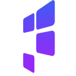

<h1 align="center">
  <br/>
  Pro Gallery
</h1>

Blazing fast & beautiful galleries built with React. [Try it out now.](https://pro-gallery.surge.sh)
 - Responsive
 - Lazy loading
 - Infinite Scroll
 - Fully Customizable
 - Supports images, videos, and HTML

[](https://www.npmjs.com/package/pro-gallery)
[](https://travis-ci.org/wix/pro-gallery)


## Gettings Started
The best way to get started is by using the [Playground](https://pro-gallery.surge.sh). Use the sidebar to configure the gallery layout you need. When you're done,  click the `Generate Gallery Code` button to get the copy-paste-ready code.
All you need to do after that is specify the images `array` for the gallery to process - and your gallery is ready!

### Installation
Install with `npm`
```sh
npm i -S pro-gallery
```
or `yarn`
```sh
yarn add pro-gallery
```

### Basic Code
```jsx
import { ProGallery } from 'pro-gallery';
import 'pro-gallery/dist/statics/main.css';

<ProGallery
  domId={domId}
  items={items}
  options={options}
  container={container}
  scrollingElement={() => document.getElementById('gallery') || window}
  eventsListener={(eName, eData) => console.log({eName, eData})}
/>
```

To see more options and a real usage example, use the [playground source code](https://github.com/wix-incubator/pro-gallery/blob/master/packages/playground/src/components/App/App.js) as reference.

### Options
The gallery has A LOT of options, so to make it all easier, we created the [Playground](https://pro-gallery.surge.sh). Each option is expandable in the sidebar, and has all the info you need about using it.
Notice that you can click on `Generate Gallery Code` anytime to get the code for the gallery layout you created.

### Items
For the code you generated to work you need to do just one more thing - provide it with a list of objects, each containing at least an id, dto, and metadata:
```jsx
const items = [
  { // Image item:
    itemId: 'sample-id',
    mediaUrl: 'sample-image-url',
    metaData: {
      type: 'image',
      height: 200,
      width: 100,
      title: 'sample-title',
      description: 'sample-description',
      focalPoint: [0, 0],
      link: {
        url: 'http://example.com',
        target: '_blank'
      },
    }
  },
  { // Video item:
    itemId: 'sample-id',
    mediaUrl: 'sample-video-url',
    metaData: {
      type: 'video',
      height: 200,
      width: 100,
  		poster: 'sample-image-url',
      title: 'sample-title',
      description: 'sample-description',
      focalPoint: [0, 0],
      link: {
        url: 'http://example.com',
        target: '_blank'
      },
    }
  },
  { // HTML item:
    itemId: 'sample-id',
    html: "<div style='width: 300px; height: 200px; background:pink;'>I am a text block</div>",
    metadata: {
      type: "text",
      height: 200,
      width: 300,
      title: 'sample-title',
      description: 'sample-description',
      backgroundColor: 'pink'
    },

  },
  {...},
  {...}
]
```

### Container
An object containing the width and height (in pixels) of the gallery.
These values should change when the container resizes, to allow the gallery to be responsive.
```js
const container = {
  width: 1000,
  height: 500,
}
```
The `width` and `height` values represent the size of the gallery. Thus, the gallery will size inner items to fit exactly into that size. Notice that when `infiniteScroll` is enabled, vertical galleries will ignore the `height` parameter and horizontal galleries will ignore the `width` parameter.

### domId
A unique Id for the gallery. Use this if you plan to display multiple galleries on the same page, or when using SSR - to make sure the gallery does not "flicker" in the hydrate phase.

### Scrolling Element
The DOM element inside which the gallery is scrolled (defaults to `window`). If the gallery is scrolled inside a different element, pass its dom reference in this property. You can also pass a function that returns that dom element.
*notice:* this is relevant to vertical galleries only. Horizontal galleries (e.g. slideshow) are handling the scroll themselves.

### Events Listener
A callback function that gets called whenever something happens in the gallery. This allows you to react to specific events.
The most important events are:

| Event Name        |  Description  |
| --------------- | ----------- |
| `GALLERY_CHANGE`  | Fired whenever the gallery finished rendering, usually after the props were changed. This event contains the structure data of the gallery. |
| `ITEM_ACTION_TRIGGERED`  | Fired whenever one of the items is clicked or tapped and the gallery cannot handle the action itself (e.g. open an expanded view). |
| `NEED_MORE_ITEMS`  | Fired whenever the gallery is scrolled near its last item. If you are using a pagination server, this is the event that should trigger the next page and re-render the gallery with new items. |

The full list of the gallery events is [here](https://github.com/wix-incubator/pro-gallery/blob/master/packages/gallery/src/common/constants/events.js).

### Custom Renderers
The Gallery supports custom renderers both for the Hover Element (appears when hovering over an item) and the Info Element (appears below / above an item).
To replace the default rendering of these elements, pass a function that will receive the props of an item and that in turn should return a JSX element. For example:
```
<ProGallery
  {...otherProps}
  customHoverRenderer={itemProps => <div>Hover #{itemProps.idx}</div>}
  customInfoRenderer={itemProps => <div>Info #{itemProps.idx}</div>}
  customLoadMoreRenderer={galleryProps => <button>Load More</button>}
/>
```
